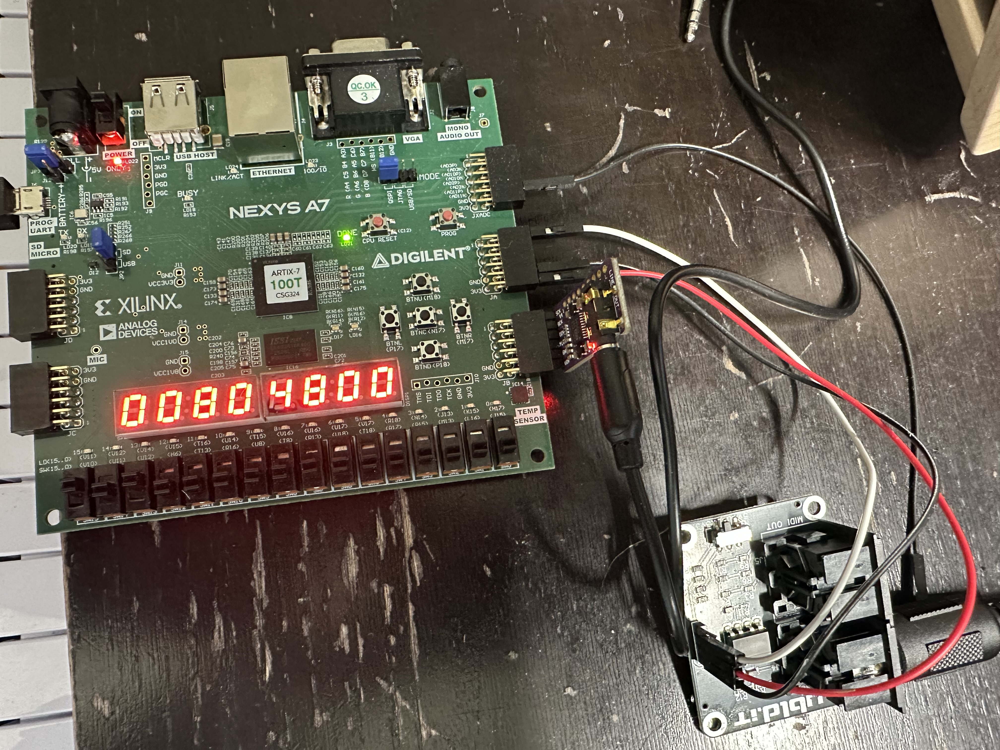

# fpga-midi-synth
Polyphonic midi synth for Digilent Nexys A7. Work in progress.

# Overview
This is a Vivado project written in VHDL (test benches written in System Verilog). It is targeting the [Digilent Nexys A7](https://digilent.com/reference/programmable-logic/nexys-a7/reference-manual) development board. It also uses the following external boards:

 - [ubld.it midi breakout board - multi voltage](https://www.amazon.com/dp/B08JC1SZHG). As you can see in the picture below I'm running this at 3.3V connected to the Pmod JA port(pins 1 - 6). See Nexys A7 ref above. You can find my custom midi implementation in [midi_in.vhd](polysynth/polysynth.srcs/sources_1/new/midi_in.vhd)

 - [Teyleten Robot PCM5102 DAC Board](https://www.amazon.com/dp/B09C5QX228). Reference [here](https://www.ti.com/lit/ds/symlink/pcm5102.pdf). This is also running at 3.3v connected to the Pmod JB port (pins 1 - 6). See Nexys A7 ref above. You can find the I2S protocol implementation in [i2s.vhd](polysynth/polysynth.srcs/sources_1/new/i2s.vhd)

As you can see the last midi data read is displayed on the seven segment display.
 # Status

This is a hobby project and a work in progress. It does respond to MIDI inputs and generates the correct square wave audio signal for each note. I verified audio frequencies with an oscilloscope. Simultaneously played notes are mixed in a simple mixer (polyphony up to 8). It also displays the last received MIDI data on the 7seg display. It is buggy and does glitch (missed midi cmds, occasionally bad audio). Some of these bugs may be related to clock domain crossing. Clocks:
 - 100mhz Nexys A7 system clock
 - 12.28mhz (PPL IP) DAC master clock
 - 31250hz MIDI serial communication clock
 - 48Khz DAC word select clock

TODOS:
 - Fix timing warnings. There are multiple clock domains and there is a bunch of cross domain communication. I have a branch I'm working on to fix this
 - Refactor. Midi decoder and voices architecture needs to be organized differently. 
 - More waveforms (sine, pwm, saw), envelopes, filters, LFOs, etc. This will also involve the refactoring mentioned above. 

## License

[MIT License](./LICENSE)

Copyright (c) 2025 Mark Perrotta
